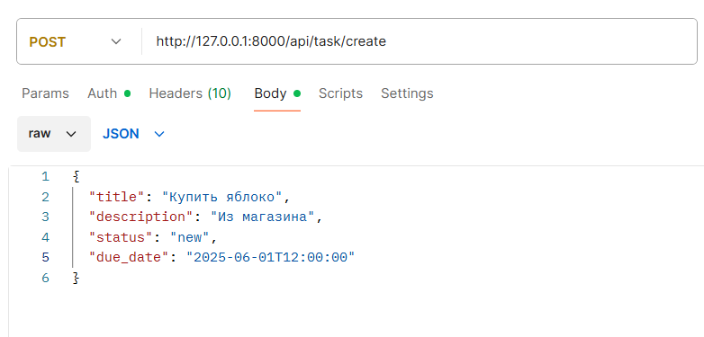
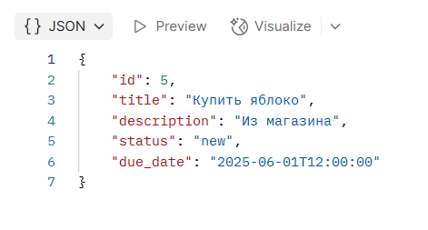

# Task Manager API

Простой REST API для управления задачами.  
Реализовано на FastAPI, с использованием SQLAlchemy и Pydantic.

## Возможности

- Создание задач с полями: `title`, `description`, `due_date`, `status`
- Обновление статуса и описания задач
- Удаление задач
- Фильтрация по `status` и `due_date`
- Авторизация через токен в заголовке `Authorization: Bearer <token>`
- Swagger-документация

## Технологии

- Python 3.13.2
- FastAPI  0.115.12
- SQLAlchemy 2.0.41  
- Pydantic 2.11.4  
- SQLite

## Авторизация

Токен для авторизации: mysecrettoken


Swagger поддерживает авторизацию через кнопку **"Authorize"**.

## Установка и запуск

```bash
git clone <repo-url>
cd task_manager
python -m venv venv
source venv/bin/activate  # Windows: venv\Scripts\activate
pip install -r requirements.txt
uvicorn app.main:app --reload

После запуска перейти в браузер
http://localhost:8000/docs


## Эндпоинты
GET	    /api/tasks
POST	/api/task/create
DELETE	/api/task/{task_id}/delete
PATCH	/api/task/{task_id}/status
PATCH	/api/task/{task_id}/edit

## Примеры запросов
Создать задачу:

    POST http://127.0.0.1:8000/api/task/create
    Authorization: Bearer mysecrettoken
    Content-Type: application/json

    {
    "title": "Buy milk",
    "description": "From the store",
    "status": "new",
    "due_date": "2025-06-01T12:00:00"
    }


Вывести задачи с опциональной фильтрацией:

    GET http://127.0.0.1:8000/api/tasks?status=new&due_before=2025-06-25T00:00:00
    Authorization: Bearer mysecrettoken


Редактировать задачу:

    PATCH http://127.0.0.1:8000/api/task/1/edit
    Authorization: Bearer mysecrettoken
    Content-Type: application/json

    {
    "description": "Updated desc",
    "due_date": "2025-06-10T15:00:00"
    }


Обновление задачи:

    PATCH http://127.0.0.1:8000/api/task/1/status
    Authorization: Bearer mysecrettoken
    Content-Type: application/json

    {
    "status": "done"
    }


Пример на postman:



ответ:


